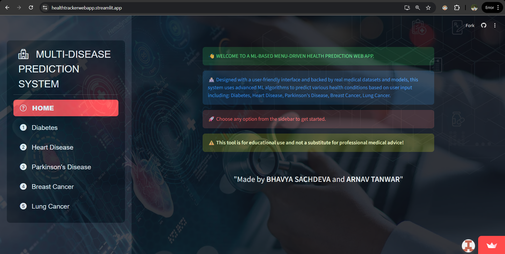

# 🩺 Multi-Disease Prediction System

A **Machine Learning-based web application** designed to predict multiple diseases — **Diabetes, Heart Disease, Parkinson’s Disease, Breast Cancer, and Lung Cancer** — using clinical data.  
This project leverages **Support Vector Machines (SVM)** and **Logistic Regression** models to provide accurate and interpretable health predictions through a simple **Streamlit** interface.

---

## 📘 Project Overview
The **Multi-Disease Prediction System** is developed to assist in the early detection of major chronic diseases by analyzing patient health data.  
Traditional diagnostic methods can be expensive, time-consuming, and inaccessible to many patients.  
This system uses **machine learning algorithms** to deliver quick, cost-effective, and reliable predictions that can support medical professionals in preliminary screening.

---

## 🚀 Features
- Predicts **five major diseases**: Diabetes, Heart Disease, Parkinson’s Disease, Breast Cancer, and Lung Cancer  
- Uses **Support Vector Machine (SVM)** and **Logistic Regression** for accurate classification  
- Interactive **Streamlit web app** for easy use  
- Clean and modular **Python code structure** for scalability  
- Built using **publicly available medical datasets** (UCI & Kaggle)

---

## 🧠 Machine Learning Models
- **Support Vector Machine (SVM)**: Chosen for robustness and high accuracy on complex datasets  
- **Logistic Regression**: Offers interpretability and efficiency for binary classification  

---

## 🧩 Datasets Used
- **Diabetes** – PIMA Indian Diabetes dataset from Kaggle  
- **Heart Disease** – Cleveland Heart Disease dataset from UCI Machine Learning Repository 
- **Parkinson’s Disease** – UCI Parkinson’s Telemonitoring dataset
- **Breast Cancer** – Wisconsin Breast Cancer dataset (Diagnostic) from UCI Machine Learning Repository  
- **Lung Cancer** – Lung Cancer dataset sourced from Kaggle

---

## 👩‍💻 Tech Stack
- **Programming Language:** Python 3.8+  
- **Framework:** Streamlit  
- **Libraries:** scikit-learn, pandas, numpy, matplotlib, streamlit
- **Development Tools:** Jupyter Notebook / Google Colab, VS Code / Spyder IDE

---

## 🖥️ App Interface

---

## 📊 Results

| Disease         | Algorithm Used       | Training Accuracy | Testing Accuracy |
|-----------------|----------------------|-------------------|------------------|
| Diabetes        | SVM                  | 93.51%            | 90.38%           |
| Heart Disease   | Logistic Regression  | 85.12%            | 81.97%           |
| Parkinson       | SVM                  | 87.18%            | 87.18%           |
| Breast Cancer   | Logistic Regression  | 96.49%            | 94.29%           |
| Lung Cancer     | Logistic Regression  | 93.93%            | 90.32%           |

Webapp Link: https://healthtrackerwebapp.streamlit.app/
